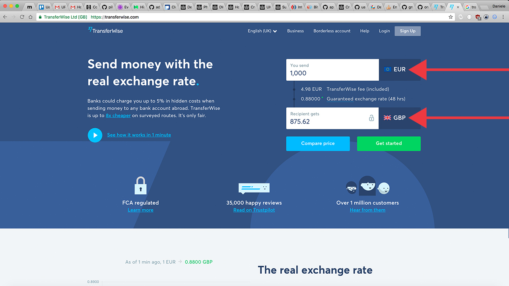
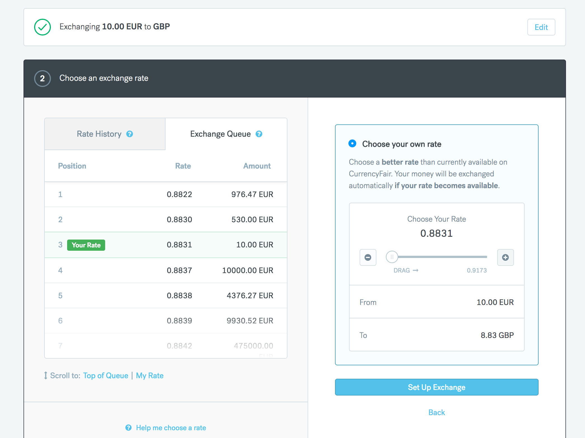
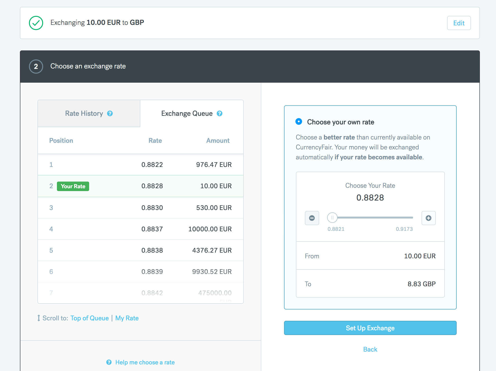
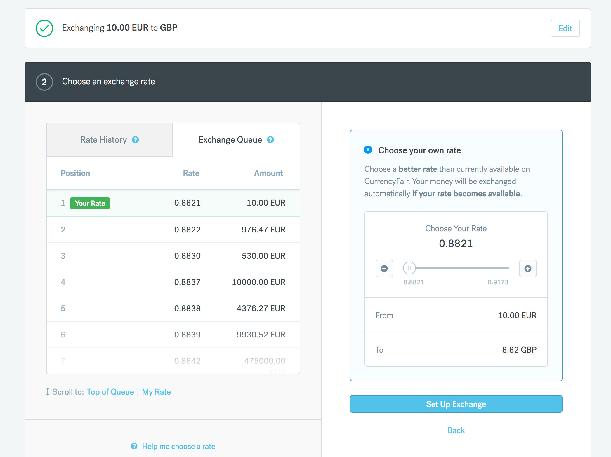

# [fit] trading bot hero

### @danielepolencic

---


---

# once upon a time... :sparkles:

---


---

# :earth_africa: money transfer

---

# have you ever noticed?

---


---



---


---


---


---


---


---


---

## eur/gbp __0.88__
## gbp/eur __1.1364__

---

# send £1000 __to :woman:__

---

# £1 :arrow_right: €1.13640

---

# :information_desk_person: €1136.40

---

# send the money back

---

# €1 :arrow_right: £0.88

---

# €1136.40 * 0.88

---

# £1000.032

---

# :scream: __£1000__.032 :scream:

---

# __surely__ it's just transferwise

---


---

# £1 :arrow_right: €1.13612

---

# __BUY__ €1136.12 
## __price gbp/eur__ 1.13612

---

# €1 :arrow_right: £0.8802

---

# __SELL__ €1136.12
## __price eur/gbp__ 0.8802

---

# £1000.012

---

# :scream: __£1000__.012 :scream:

---

## this doesn't make any sense

---


---


---


---


---


---


---


---


---


---


---


---


---


---


---

# :swimmer: liquidity :shower:

---

# :money_with_wings: just pennies :money_with_wings:

---


---


---

# __BUY__ @1.25
# __SELL__ @0.8032

---

# 1.25 __*__ 0.8032

---

# :scream: __£100__4 :scream:

---

# 2 transactions per day
# 20 days per month

---

# __2 * 20 * £4__ = £160[^*]

[^*]: best case scenario

---

# time to build something

---

# :sparkles: 3 wishes :sparkles:

---

# 1. :ear:

---

## :ear: to price changes

---

## __1.13612 * 0.88 =__ 0.99978 :x:
## __1.13612 * 0.882 =__ 1.00205 :white_check_mark:

---


## __:ear: to price changes__
## :ear: to order changes

---

## created
## modified
## partially matched
## matched in full

---

## __:ear: to price changes__
## __:ear: to order changes__
## :ear: to balance changes

---

## deposit :moneybag:
## withdraw :moneybag:
## orders matched in full 

---

## :clock11::clock9::clock7:
# 2. time travel

---


---

## :rewind: market conditions
## debugging & :mag:

---

# 3. :passport_control: bulletproof testing

---


---

> "As part of its normal process, the UTP distributed test data and certain third parties improperly propagated the data."
- NASDAQ

---


---

# oops

---

# mvp :one:

---

## scalable architecture
## :rabbit:MQ
## mysql

^ ts 1.8

---


---


---


---


---

## :weary:
## overengineered

---

## :weary:
## sync state

^ syncing state means that I couldn't reboot the server easily
^ hard to test rabbitMQ. proxy-require modules
^ no need for multiple workers
^ hard to manage deployments

---


---


---


---


---


---


---


---


---


---


---

# mvp :two:

---


---

## 𝒻(state, message) -> state

---

```js
const message = {
  type: 'PRICE_TICK',
  price: 1.3508
};

const state = {
  currentPrice: 1.3502
};
```

---

```js
function update(state, message) {
  switch(message.type) {

  case 'PRICE_TICK':
    return {
      ...state,
      currentPrice: message.price
    };

  default:
    return state;
  }
}

const newState = update(state, message);

console.log(newState); // {currentPrice: 1.3508};
```

---


---

## redux
## leveldb
## docker

^ ts 1.9

---

## :weary:
## crashes

---

## :weary:
## redux actions & orchestration

^ 1. leveldb is a :black_joker:
^ 2. crashes

---

# Bad :x:

```js
function update(state, message) {
  switch(message.type) {

  case 'PRICE_TICK':

    /* SIDE EFFECT! */
    updateOrderWithPrice(message.price);

    return {
      ...state,
      currentPrice: message.price
    };

  default:
    return state;
  }
}
```

---

#  Good :white_check_mark: 

```js
function getPrice(dispatch) {
  dispatch({type: 'PRICE_TICK'});

  updateOrderWithPrice(message.price).then(order => {
    dispatch({type: 'ORDER_UPDATED', order});
  });
}
```

---

# Good :white_check_mark:

```js
function(state, action) {
  switch(action.type) {

  case 'PRICE_TICK':
    return {
      ...state,
      currentPrice: message.price
    };

  case 'ORDER_UPDATED':
    return {
      ...state,
      openOrder: message.order
    };
  }
}
```

---

## flow and state are separated

---

## redux saga
## redux thunk
## mobx + rxjs

---

# mvp :three:

---

## 𝒻(state, msg) -> [state, cmd]

---

```js
function(state, message) {
  switch(message.type) {

    case 'PRICE_TICK':
      return [
        {...state, currentPrice: message.price},
        updateOrderWithPrice(message.price)
      ];
  }
}
```

---

# updateOrderWithPrice(message.price)

```js
function updateOrderWithPrice(price) {
  return {
    commandType: 'UPDATE_ORDER',
    price
  };
}

console.log(updateOrderWithPrice(1.2)) // {
                                       //   price: 1.2,
                                       //   commandType: 'UPDATE_ORDER'
                                       // }
```

---


---


---


---


---

# free monad
### (interpreter pattern)

^ ts 2.0, 2.1, 2.2
^ redux-like state
^ redis

---

# AST

```js
const fetch = {
  commandType: 'FETCH',
  url: '/any_url'
};

const log = {
  commandType: 'LOG',
  value: 'Hello World!'
};
```

---

# interpreter

```js
function interpreter(commands) {
  commands.forEach(command => {
    switch(command.commandType) {

    case 'FETCH':
      request(command.url);

    case 'LOG':
      console.log(command.value);
    }

  });
}
```

---

## no side effects

---


---

## [ state,
## updateOrderWithPrice(1.2) ]

---


---


---


---


---


---

## 1. elm
## 2. redux-loop
## 3. redux-effects

---

## state + logic :two_women_holding_hands:
## easier testing
## interpreter

---

## :weary:
## monads are hard

---

# mvp :three:.:one:

---

## actors

^ ts 2.3, 2.4
^ redux-like state
^ redis

---


---


---


---


---


---


---


---


---


---


---


---


---


---

## fully decoupled effects and business logic
## 200 LoC

---

## if a :evergreen_tree: falls in a forest
## does it make a sound?

---

# testing

----

## 1. data driven

---

# updateOrder

```ts
updateOrder(order: Order, price: number): State

enum State {
  UPDATE,
  DO_NOTHING,
  CANCEL
}
```

---



---



---



---

# unit testing

```js
it('should update the order', () => {
  const order = {id: 1, price: 1.12, active: true};
  const currentTickPrice = 1.11;
  expect(updateOrder(order, currentTickPrice)).toEqual(UPDATE);
});
```

---

# unit testing

```js
it('should update the order', () => {
  const order = {id: 1, price: 1.12, active: true};
  const currentTickPrice = 1.11;
  expect(updateOrder(order, currentTickPrice)).toEqual(UPDATE);
});

it('should cancel the order', () => {
  const order = {id: 1, price: 1.12, active: true};
  const currentTickPrice = 1.22;
  expect(updateOrder(order, currentTickPrice)).toEqual(CANCEL);
});
```

---

# unit testing

```js
it('should update the order', () => {
  const order = {id: 1, price: 1.12, active: true};
  const currentTickPrice = 1.11;
  expect(updateOrder(order, currentTickPrice)).toEqual(UPDATE);
});

it('should do nothing', () => {
  const order = {id: 1, price: 1.12, active: true};
  const currentTickPrice = 1.12;
  expect(updateOrder(order, currentTickPrice)).toEqual(DO_NOTHING);
});

it('should cancel the order', () => {
  const order = {id: 1, price: 1.12, active: true};
  const currentTickPrice = 1.22;
  expect(updateOrder(order, currentTickPrice)).toEqual(CANCEL);
});
```

---

```js
it('should update the order');
it('should do nothing');
it('should cancel the order');
```

---

```js
it('should update the order');
it('should do nothing');
it('should cancel the order');

it('should NOT update the order');
it('should NOT do nothing');
it('should NOT cancel the order');
```

---

```js
it('should update the order', () => {
  const order = {id: 1, price: 1.12, active: true};
  const currentTickPrice = 1.11;
  expect(updateOrder(order, currentTickPrice)).toEqual(UPDATE);
});

it('should do nothing', () => {
  const order = {id: 1, price: 1.12, active: true};
  const currentTickPrice = 1.12;
  expect(updateOrder(order, currentTickPrice)).toEqual(DO_NOTHING);
});

it('should cancel the order', () => {
  const order = {id: 1, price: 1.12, active: true};
  const currentTickPrice = 1.22;
  expect(updateOrder(order, currentTickPrice)).toEqual(CANCEL);
});

it('should NOT update the order', () => {
  const order = {id: 1, price: 1.12, active: true};
  const currentTickPrice = 1.11;
  expect(updateOrder(order, currentTickPrice)).toEqual(UPDATE);
});

it('should NOT do nothing', () => {
  const order = {id: 1, price: 1.12, active: true};
  const currentTickPrice = 1.12;
  expect(updateOrder(order, currentTickPrice)).toEqual(DO_NOTHING);
});

it('should NOT cancel the order', () => {
  const order = {id: 1, price: 1.12, active: true};
  const currentTickPrice = 1.22;
  expect(updateOrder(order, currentTickPrice)).toEqual(CANCEL);
});
```

---

## duplication :dancers:
## duplication :dancers:

---

# unit testing

```js
it('should update the order', () => {

  const order = {id: 1, price: 1.12, active: true};
  const currentTickPrice = 1.11;

  expect(updateOrder(order, currentTickPrice)).toEqual(UPDATE);
});
```

---

# unit testing

```js
it('should update the order', () => {
  const order = {id: 1, price: 1.12, active: true}; // CHANGE ME
  const currentTickPrice = 1.11; // CHANGE ME
  expect(updateOrder(order, currentTickPrice)).toEqual(UPDATE);
});
```

---


---

# unit testing

```js
test(updateOrder, () => {
  given({id: 1, price: 1.11, active: true}, 1.12).expect(UPDATE);
  given({id: 1, price: 1.12, active: true}, 1.12).expect(DO_NOTHING);
  given({id: 1, price: 1.12, active: true}, 1.22).expect(CANCEL);
});
```

---

# unit testing

```js
test(updateOrder, () => {
  given({id: 1, price: 1.11, active: true}, 1.12).expect(UPDATE);
  given({id: 1, price: 1.12, active: true}, 1.12).expect(DO_NOTHING);
  given({id: 1, price: 1.12, active: true}, 1.22).expect(CANCEL);

  given({id: 1, price: 1.11, active: false}, 1.12).expect(DO_NOTHING);
  given({id: 1, price: 1.12, active: false}, 1.12).expect(DO_NOTHING);
  given({id: 1, price: 1.12, active: false}, 1.22).expect(DO_NOTHING);
});
```

---

# 2. sound :musical_note:

---

# orders

```ts
const order = {
  id: 1,
  price: 1.12
};
```

---

# orders with state

```ts
const order = {
  id: 1,
  price: 1.12,
  active: true // new field
};
```

---

## old tests still pass
## /(search|replace)/gi
## unpredictable

---

# typescript

---

# orders

```ts
interace IOrder = {
  id: number
  price: number
};

const order: IOrder = {
  id: 1,
  price: 1.12
};
```

---

# orders with state

```ts
interace IOrder = {
  id: number
  price: number
  active: boolean
};

const order: IOrder = { // ERROR! `active` is missing
  id: 1,
  price: 1.12
};
```

---

# 3. integration

---


---


---


---

## very hard to setup
## harder to maintain
## time consuming

---

# but…

---

## 𝒻(state, msg) -> [state, cmd]
### +
## snapshot testing

---

```ts
const messages = [
  {type: 'TICK', price: 1.12},
  {type: 'TICK', price: 1.13},
  {type: 'SUBMITTED', price: 1.13},
  {type: 'COMPLETED', id: 1},
];

const initialState = {
  openOrders: []
};

const finalState = messages.reduce((state, message) => {
  return Update(state, message);
});

expect(finalState).toMatchSnapshot();
```

---


---


# show me the :dollar:!

---


---


---


---


---

## :two::heavy_multiplication_x: initial investment

---

# 957 transactions,
# 3 motnhs later…

---


---

# lessons learned

---

## :one: js is awesome

---

## proper type system
## transpilers
## functional, CQRS, etc.

---

## :two: trading is coding

---

## not only python/r/c++
## no MBA/Phd
## no special HW or SW

---


---

## :three: build once, run everywhere

---

## bitcoin
## stock
## forex

---

# hungry for more?

- [The Elm Architecture（0.18）effect moduleメモ](http://qiita.com/jooex/items/9cca8e4ec900b52ef30c)
- [Effect Manager のしくみ](http://qiita.com/jinjor/items/bf61f8443efb0ce1b036)
- [How to structure Elm with multiple models?](https://www.reddit.com/r/elm/comments/5jd2xn/how_to_structure_elm_with_multiple_models/)
- [Tribeca](https://github.com/michaelgrosner/tribeca)
- [Blackbird](https://github.com/butor/blackbird)
- [Extensible Effects in Node.js, Part 1](https://www.humblespark.com/blog/extensible-effects-in-node-part-1)

---

# [fit] thanks
### @danielepolencic
