# [fit] trading bot hero

### @danielepolencic

---


---

# once upon a time... :sparkles:

---


---

# have you ever noticed?

---

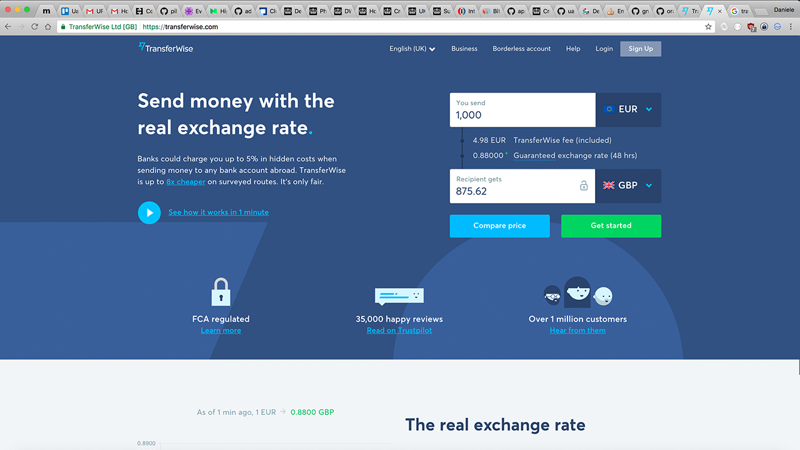

---

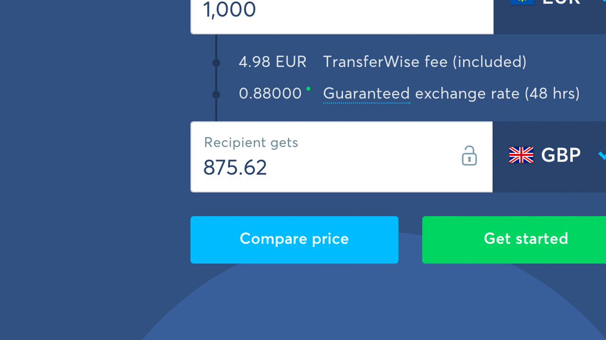

---

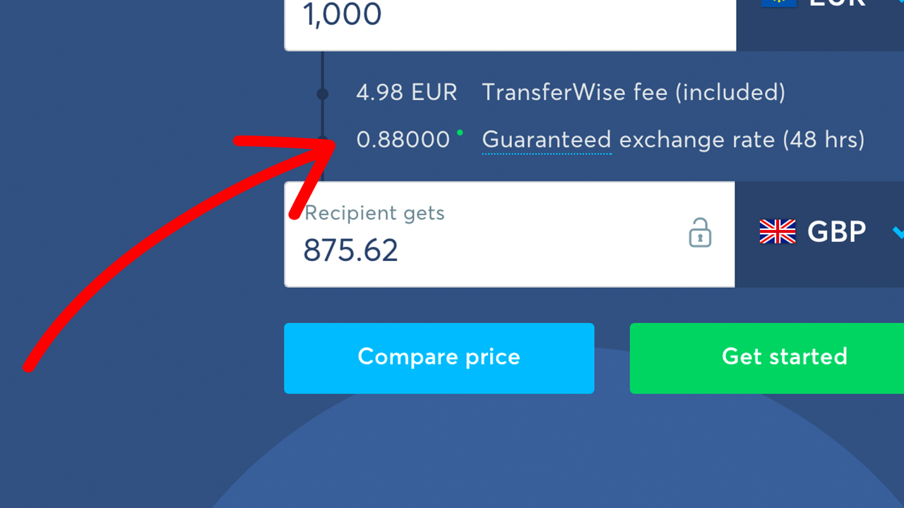

---


---

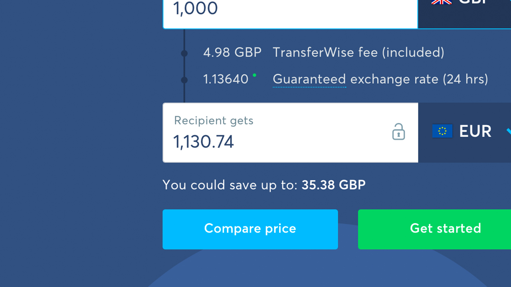

---

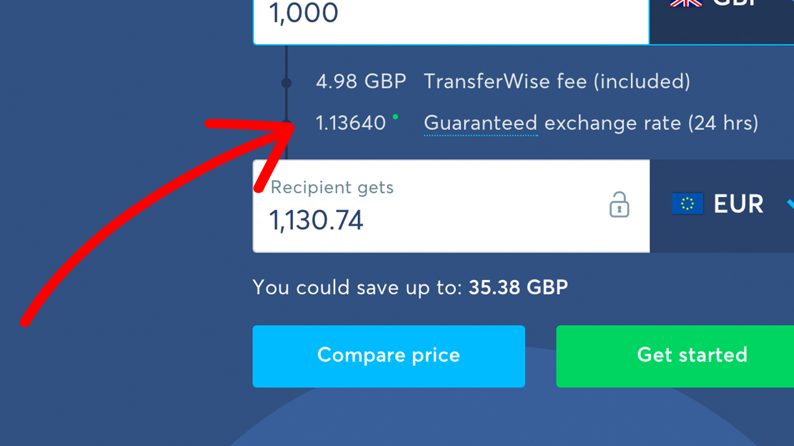

---

# i want to send £1000
## __to :woman:__

---

# £1 :arrow_right: €1.13640

---

# :information_desk_person: €1136.40

---

# "i changed my mind"

---

# €1 :arrow_right: £0.88

---

# €1136.40 * 0.88

---

# £1000.032

---

# :scream: __£1000__.032 :scream:

---

# __surely__ it's just transferwise

---

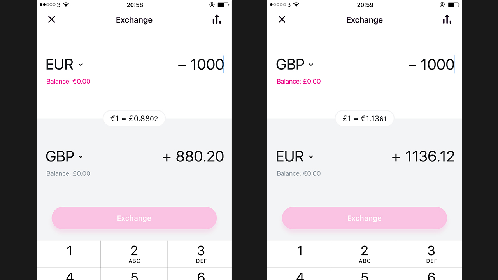

---

# £1 :arrow_right: €1.13612

---

# __BUY__ €1136.12 
## __price gbp/eur__ 1.13612

---

# €1 :arrow_right: £0.8802

---

# __SELL__ €1136.12
## __price eur/gbp__ 0.8802

---

# £1000.012

---

# :scream: __£1000__.012 :scream:

---

## this doesn't make any sense

---


---


---


---


---


---


---


---


---


---


---


---


---


---

# :swimmer: liquidity :shower:

---

# :money_with_wings: just pennies :money_with_wings:

---


---

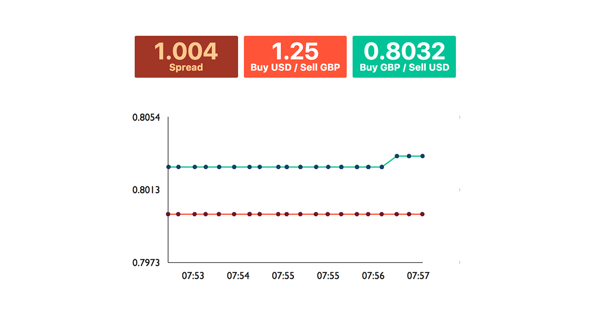

---

# __BUY__ @1.25
# __SELL__ @0.8032

---

# 1.25 __*__ 0.8032

---

# :scream: __£100__4 :scream:

---

# 2 transactions per day
# 20 days per month

---

# __2 * 20 * £4__ = £160[^*]

[^*]: best case scenario

---

# time to build something

---

# :sparkles: 3 wishes :sparkles:

---

# 1. :ear:

---

## :ear: to price changes

---

## __1.13612 * 0.88 =__ 0.99978 :x:
## __1.13612 * 0.882 =__ 1.00205 :white_check_mark:

---


## __:ear: to price changes__
## :ear: to order changes

---

## created
## modified
## partially matched
## matched in full

---

## __:ear: to price changes__
## __:ear: to order changes__
## :ear: to balance changes

---

## deposit :moneybag:
## withdraw :moneybag:
## orders matched in full 

---

## :clock11::clock9::clock7:
# 2. time travel

---


---

## :rewind: market conditions
## debugging & :mag:

---

# 3. :passport_control: bulletproof testing

---


---

> "As part of its normal process, the UTP distributed test data and certain third parties improperly propagated the data."
- NASDAQ

---

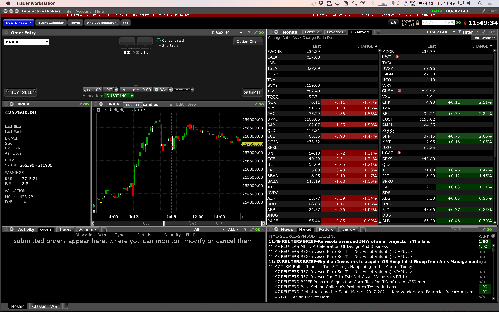

---

# oops

---

# mvp :one:

---

## scalable architecture
## :rabbit:MQ
## mysql

^ ts 1.8

---


---


---


---


---

## 1. no need for multiple workers
## 2. hard to manage deployments
## 3. state machine

^ syncing state means that I couldn't reboot the server easily
^ hard to test rabbitMQ. proxy-require modules

---


---


---


---


---


---


---


---

# mvp :two:

---

## redux
## leveldb
## docker

^ ts 1.9

---


---


---

## 𝒻(state, message) -> state

---

```js
function update(state, message) {
  switch(action.type) {

  case ORDER_OPENED:
    /* ... */

  default:
  return state;
  }
}
```

---

```js
const message = {
  type: ORDER_OPENED,
  price: 1.3508
};

const state = {
  openOrders: []
};

const newState = update(state, message);

console.log(newState); // {openOrders: {id: 1}};
```

---

## 1. leveldb is a :black_joker:
## 2. crashes
## 3. redux actions & orchestration

---

# Reducers are pure

---

# Bad :x:

```js
function(state, action) {
  switch(action.type) {
  case UPDATED_ORDER:
    fetch(`/order${action.payload.orderId}`);
    return state;
  }
}
```

---

#  Good :white_check_mark: 

```js
function doAction(dispatch) {
  dispatch({type: UPDATED_ORDER, id: '1'});

  fetch(`/order${action.payload.orderId}`).then(order => {
    dispatch({type: ORDER_RETRIEVED, order});
  });
}
```

---

# Good :white_check_mark:

```js
function(state, action) {
  switch(action.type) {
  case UPDATED_ORDER:
    /* update state */
    return state;
  }
  case ORDER_RETRIEVED:
    /* update state */
    return state;
  }
}
```

---

## 1. retrieve price
## 2. update order

---

```js
function(dispatch, getState) {
  const order = getState().order;

  dispatch({type: RETRIEVE_PRICE});

  fetch('/price').then(price => {
    if (price > order.price) {

      dispatch({type: UPDATE_ORDER, orderId: order.id, price});

      fetch('/update/order/{order.id}`, {price}).then(order => {
        dispatch({type: ORDER_UPDATED, order});
      });
    };
  });
}
```

---

# meanwhile in the state...

---

```js
function(state, message) {
  switch(action.type) {
  case RETRIEVE_PRICE:
    return {...state, isPending: true};
  case UPDATE_ORDER:
    return {...state, fetchingOrder: true};
  case ORDER_UPDATED:
    return {...state, order: action.order};
  }
}
```

---

# nah, it's not my problem

---

## redux saga
## redux thunk
## mobx + rxjs

---

# mvp :three:

---

## free monad
## redux-like state
## redis

^ ts 2.0, 2.1, 2.2

---

## 𝒻(state, msg) -> [state, cmd]

---

## 1. elm
## 2. redux-loop
## 3. redux-effects

---

```js
function(state, message) {
  switch(message.type) {
    case PRICE_UPDATED:
      if (message.price > state.currentPrice) {
        return [state, fetch(`/update/${state.order.id}`, {price})];
      } else {
        return [state, NONE];
      }
  }
}
```

---

# console.log(fetch('url'));

```js
{
  type: 'FETCH',
  payload: {url: 'url'}
}
```

---

## state + logic :two_women_holding_hands:
## easier testing
## interpreter

---


---

# getPricesNow()

---


---


---


---


---


---

## monads are hard
## suspended execution
## complex code

---

# mvp :three:.:one:

---

## redux-like state
## redis
## actors

^ ts 2.3, 2.4

---


---


---


---


---


---


---


---


---


---


---


---


---


---

## fully decoupled effects and business logic
## 200 LoC

---

# testing

----

# TDD, ATDD, BDD…

---

# B__uzzword__ D__riven__ D__evelopment__

---

## robust
## no coupling
## comprehensive

---

# updateOrder

```ts
updateOrder(order: Order, price: number): State

enum State {
  UPDATE,
  DO_NOTHING,
  CANCEL
}
```

---

top of the queue

---

# unit testing

```js
it('should update the order', () => {
  const order = {id: 1, price: 1.12, active: true};
  const currentTickPrice = 1.11;
  expect(updateOrder(order, currentTickPrice)).toEqual(UPDATE);
});
```

---

# unit testing

```js
it('should update the order', () => {
  const order = {id: 1, price: 1.12, active: true};
  const currentTickPrice = 1.11;
  expect(updateOrder(order, currentTickPrice)).toEqual(UPDATE);
});

it('should cancel the order', () => {
  const order = {id: 1, price: 1.12, active: true};
  const currentTickPrice = 1.22;
  expect(updateOrder(order, currentTickPrice)).toEqual(CANCEL);
});
```

---

# unit testing

```js
it('should update the order', () => {
  const order = {id: 1, price: 1.12, active: true};
  const currentTickPrice = 1.11;
  expect(updateOrder(order, currentTickPrice)).toEqual(UPDATE);
});

it('should do nothing', () => {
  const order = {id: 1, price: 1.12, active: true};
  const currentTickPrice = 1.12;
  expect(updateOrder(order, currentTickPrice)).toEqual(DO_NOTHING);
});

it('should cancel the order', () => {
  const order = {id: 1, price: 1.12, active: true};
  const currentTickPrice = 1.22;
  expect(updateOrder(order, currentTickPrice)).toEqual(CANCEL);
});
```

---

```js
it('should update the order');
it('should do nothing');
it('should cancel the order');
```

---

```js
it('should update the order');
it('should do nothing');
it('should cancel the order');

it('should NOT update the order');
it('should NOT do nothing');
it('should NOT cancel the order');
```

---

## duplication :dancers:
## duplication :dancers:

---

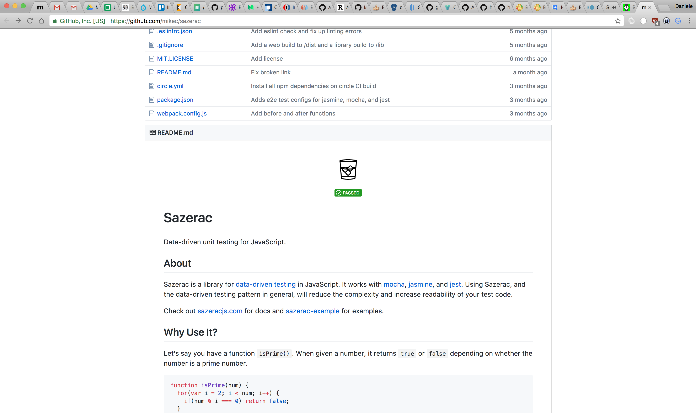

---

# unit testing

```js
test(updateOrder, () => {
  given({id: 1, price: 1.11, active: true}, 1.12).expect(UPDATE);
  given({id: 1, price: 1.12, active: true}, 1.12).expect(DO_NOTHING);
  given({id: 1, price: 1.12, active: true}, 1.22).expect(CANCEL);
});
```

---

# unit testing

```js
test(updateOrder, () => {
  given({id: 1, price: 1.11, active: true}, 1.12).expect(UPDATE);
  given({id: 1, price: 1.12, active: true}, 1.12).expect(DO_NOTHING);
  given({id: 1, price: 1.12, active: true}, 1.22).expect(CANCEL);

  given({id: 1, price: 1.11, active: false}, 1.12).expect(DO_NOTHING);
  given({id: 1, price: 1.12, active: false}, 1.12).expect(DO_NOTHING);
  given({id: 1, price: 1.12, active: false}, 1.22).expect(DO_NOTHING);
});
```

---

# incremental updates

---

# orders

```ts
const order = {
  id: 1,
  price: 1.12
};
```

---

# orders with state

```ts
const order = {
  id: 1,
  price: 1.12,
  active: true // new field
};
```

---

## old tests still pass
## /(search|replace)/gi
## unpredictable

---

# typescript

---

# orders

```ts
interace IOrder = {
  id: number
  price: number
};

const order: IOrder = {
  id: 1,
  price: 1.12
};
```

---

# orders with state

```ts
interace IOrder = {
  id: number
  price: number
  active: boolean
};

const order: IOrder = { // ERROR! `active` is missing
  id: 1,
  price: 1.12
};
```

---

# integration

---


---


---


---

## very hard to setup
## harder to maintain
## time consuming

---

# but…

---

## 𝒻(state, msg) -> [state, cmd]
### +
## snapshot testing

---

```ts
const messages = [
  {type: 'TICK', price: 1.12},
  {type: 'TICK', price: 1.13},
  {type: 'SUBMITTED', price: 1.13},
  {type: 'COMPLETED', id: 1},
];

const initialState = {
  openOrders: []
};

const finalState = messages.reduce((state, message) => {
  return Update(state, message);
});

expect(finalState).toMatchSnapshot();
```

---

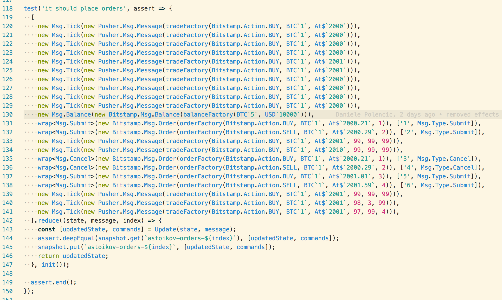

---


# all good but…

---


---


---


---


---

## :two::heavy_multiplication_x: initial investment

---

# 957 transactions,
# 3 motnhs later…

---


---

# lessons learned

---

## :one: js exponential growth

---

## proper type system
## transpilers
## functional, CQRS, etc.

---

## :two: trading is coding

---

## not only python
## not only r
## not only c++

---

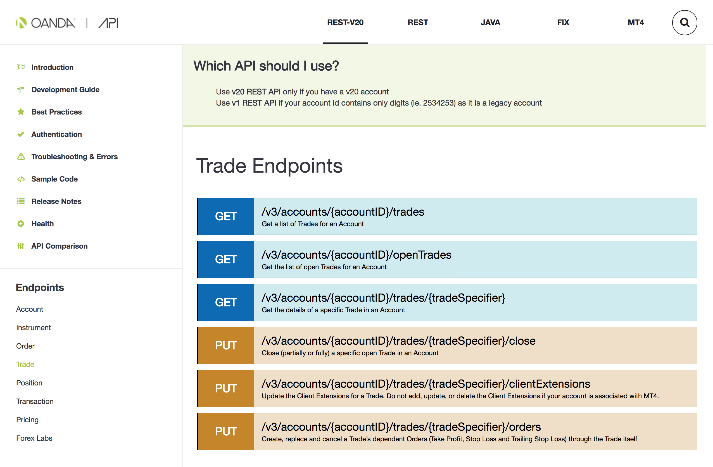

---

## :three: build once, run everywhere

---

## bitcoin
## stock
## forex

---

# hungry for more?

- [The Elm Architecture（0.18）effect moduleメモ](http://qiita.com/jooex/items/9cca8e4ec900b52ef30c)
- [Effect Manager のしくみ](http://qiita.com/jinjor/items/bf61f8443efb0ce1b036)
- [How to structure Elm with multiple models?](https://www.reddit.com/r/elm/comments/5jd2xn/how_to_structure_elm_with_multiple_models/)
- [Tribeca](https://github.com/michaelgrosner/tribeca)
- [Blackbird](https://github.com/butor/blackbird)
- [Extensible Effects in Node.js, Part 1](https://www.humblespark.com/blog/extensible-effects-in-node-part-1)

---

# [fit] thanks
### @danielepolencic
